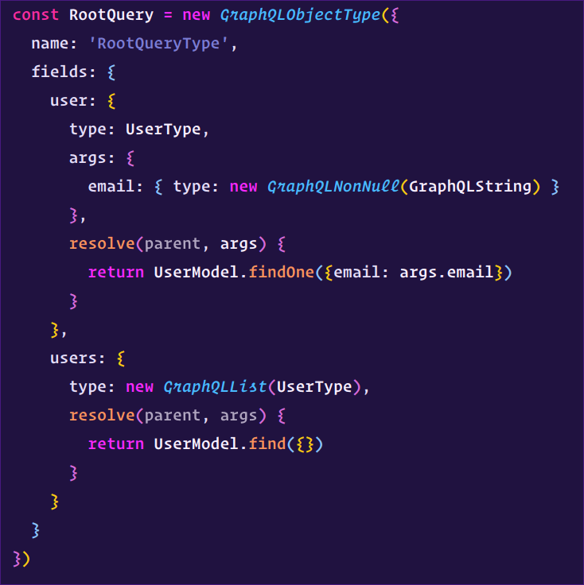

# Outrun Theme for VS Code

This is my own version of Samrap's Outrun vscode theme.

## Changes from original theme
	- The JS syntax has some syntax enhancment
	- The UI has some small fixes / improvement

---

Built originally by [Sam Rapaport](https://samrapdev.com)

---

## Installation

Outrun is available on the Extension Marketplace. Search for **Outrun**, install, and then set it as your theme!

Alternatively, you may clone this repository into your `~/.vscode/extensions` directory.

## Screenshots

#### Ruby

#### PHP

#### With Sidebar & Terminal

#### Fixes & Enhancements

Feel free to submit PR or issue if you see some bugs / improvments to be made !